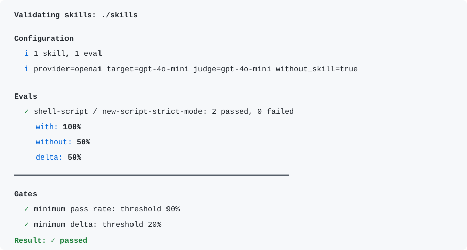

# skilpel

[](https://github.com/pasunboneleve/skilpel/actions/workflows/ci.yml?query=branch%3Amain)

`skilpel` is a Go CLI for evaluating Codex-style skills. It runs eval prompts
with and without a skill, asks a judge model to score the outputs, and turns the
result into local artifacts, terminal feedback, and CI-friendly gates.

<p style="margin: 1rem 0;">
  <picture>
    <source media="(prefers-color-scheme: dark)" srcset="docs/images/skilpel-output-dark.svg">
    <source media="(prefers-color-scheme: light)" srcset="docs/images/skilpel-output-light.svg">
    
  </picture>
</p>

Skills are prompts or instructions. `skilpel` runs the same eval with the skill
enabled and disabled, then compares the judged results. The point is to make the
claim concrete: this skill improves model output by this much, against these
assertions, under these gates.

## Why this exists

Skill repositories need a repeatable way to answer a narrow question: did this
skill change model output in the intended direction? `skilpel` keeps that check
local, explicit, and suitable for CI.

## Quick start

```bash
go test ./...
go run ./cmd/skilpel run --root ./skills --skill my-skill --eval-id basic --baseline
```

Model-backed runs use the provider selected by `--provider` or `provider` in a
config file. Run `skilpel run --help` for the current provider list, default API
key variables, endpoint override rules, and available flags.

```bash
OPENAI_API_KEY=... go run ./cmd/skilpel run \
  --root ./skills \
  --skill my-skill \
  --eval-id basic \
  --workspace ./.skilpel \
  --baseline \
  --provider openai \
  --target gpt-4o-mini \
  --judge gpt-4o-mini \
  --min-pass 0.90 \
  --min-delta 0.20
```

For scripts and downstream tooling, keep the final summary on stdout as JSON:

```bash
go run ./cmd/skilpel run --config skilpel.yaml --output=json
```

See [CLI output](docs/cli-output.md) for stdout, stderr, log-file, and exit-code
behavior.

## Current scope

`skilpel run` supports:

- provider plugins for OpenAI, xAI, Qwen, Anthropic/Claude, and Gemini
- per-skill eval files in YAML or JSON
- skill and eval filtering with `--skill` and `--eval-id`
- optional `without_skill` baseline comparison
- pass-rate and baseline-delta gates
- JSON artifacts in a workspace directory
- text, JSON, and Markdown final summaries
- structured or pretty progress logs on stderr

## Architecture at a glance

- `cmd/skilpel` owns the CLI entrypoint.
- `internal/skilpel` owns skill discovery, prompt construction, provider calls,
  judging, gates, progress logs, reports, and artifacts.
- Eval files live with the skill they test, usually as
  `<skill>/evals/evals.yaml`.
- Run artifacts are written to the configured workspace, usually `./.skilpel`.

## Installation

For downstream CI, install a tagged version rather than tracking a moving
branch:

```bash
go install github.com/pasunboneleve/skilpel/cmd/skilpel@$SKILPEL_VERSION
```

Tagged releases also publish prebuilt archives for Linux amd64 and macOS arm64.

## Validation

```bash
go test ./...
```

## Repository map

- `cmd/skilpel/`: CLI binary.
- `internal/skilpel/`: evaluator implementation and tests.
- `docs/`: focused user documentation.
- `CHANGELOG.md`: unreleased and release notes.

## Documentation

- `go run ./cmd/skilpel --help`
- `go run ./cmd/skilpel run --help`
- `go run ./cmd/skilpel version`
- [CLI output](docs/cli-output.md)
- [Eval files](docs/eval-files.md)
- [Model providers](docs/providers.md)
- [Changelog](CHANGELOG.md)

For a complete repository model with skills and evals kept close together, see
[`pasunboneleve/oiticica-style`](https://github.com/pasunboneleve/oiticica-style).

## The name

<p align="center" style="margin: 0.35rem 0 0.35rem 0;">
  <a href="https://www.metmuseum.org/art/collection/search/53215"
  target="_blank"
  rel="noopener noreferrer">
    
  </a>
</p>

<p align="center" style="margin: 0 0 1.25rem 0;">
    <sub>A scalpel cuts away the excess; a stencil preserves the pattern.</sub>
</p>

<!--
Image provenance:
Japanese katagami stencil with hemp-leaf pattern.
The Metropolitan Museum of Art, public domain.
Source: https://www.metmuseum.org/art/collection/search/53215
-->

The name points at the work `skilpel` is meant to do: cut away vague confidence
and preserve the repeatable pattern that makes a skill useful.

## Prior art

`skilpel` is inspired by
[`agent-skills-eval`](https://github.com/darkrishabh/agent-skills-eval) and
agentskills.io-style skill layouts. It focuses on the subset needed for fast
local iteration and CI: skill discovery, eval-case filtering, provider-backed
model calls, baseline comparison, and explicit pass/fail thresholds.

## License

`skilpel` is released under the [MIT License](LICENSE).
